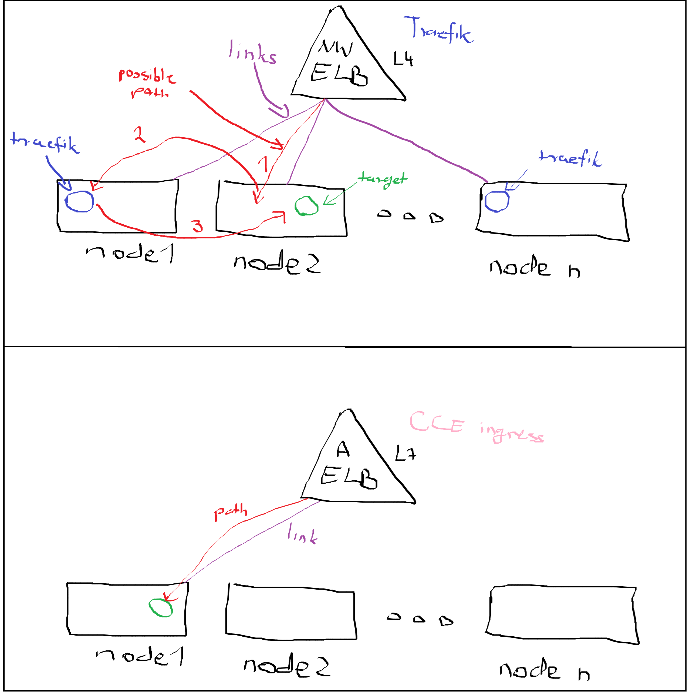

# cert-manager with CCE ingress

TODO figure out how to redirect HTTP to HTTPS

This is an example implementation for `cert-manager` in combination with `cce-ingress` controller. 

After deploying `cert-manager` and creating the `clusterIssuer` or `issuer` resources you can request/create letsencrypt certificates for your domain by annotating you `ingress` resources. `cert-manager` will automaticly request the certificate and configure the ELB. It was tested both with dedicated and shared ELB.  

# third-party ingress vs cce ingress



```yaml
apiVersion: networking.k8s.io/v1
kind: Ingress
metadata:
  name: ingress-test
  annotations:
        kubernetes.io/elb.port: '443'
        kubernetes.io/elb.id: 6e10ec9a-b6c7-436e-885a-b93b1874dc7d
        kubernetes.io/elb.class: performance
        cert-manager.io/cluster-issuer: letsencrypt
spec:
  rules:
  - host: 'cce-demo.sdombi.hu'
    http:
      paths:
      - path: '/'
        backend:
          service:
            name: nginx-service
            port:
              number: 80
        property:
          ingress.beta.kubernetes.io/url-match-mode: STARTS_WITH
        pathType: ImplementationSpecific
  tls:
  - hosts:
    - cce-demo.sdombi.hu
    secretName: letsencrypt-demo-sdombi
  ingressClassName: cce
```

# Deploy
## Terraforming ELB and DNS (optional)
Source env variables, get credentails apply terrraform. If you already have an ELB and DNS you can skip this.  
Set variables in `terraform/terraform.tfvars` if you would like to deploy ELB and DNS from this project.
```bash
elb_name = "sdombi-cert-manager"
vpc_id = "229c852a-43a4-4cb1-8b4a-71374ddbacfc"
subnet_id = "70c30353-7e08-447c-995d-ba295e83fe10"
network_id = "ff86833f-d1e8-4054-95c3-f58b5ed0c71b"
my_domain = "sdombi.hu."
my_email = "dombisza@gmail.com"
dedicated_sub_domain = "cce-demo"
shared_sub_domain = "shared"
```
```bash
source terraform/.envrc
terraform -chdir=./terraform init && terraform -chdir=./terraform apply
```

## Deploying `cert-manager` from `kube` directory
Use `helmfile` to deploy the chart
```bash
helmfile sync
```
Review and deploy either the `clusterIssuer` or one of the `Issuer` from `cert-manager` directory. You have to update the `elb.id` and set `elb.class` to performance(dedicated) or union(shared). Pls dont use my email :)
```yaml
apiVersion: cert-manager.io/v1
kind: ClusterIssuer
metadata:
  name: letsencrypt
spec:
  acme:
    server: https://acme-v02.api.letsencrypt.org/directory
    email: dombisza@gmail.com
    privateKeySecretRef:
      name: letsencrypt
    solvers:
    - http01:
        ingress:
          ingressClassName: cce
          ingressTemplate:
            metadata:
              annotations:
                "kubernetes.io/elb.port": "80"
                "kubernetes.io/elb.id": "6e10ec9a-b6c7-436e-885a-b93b1874dc7d"
                "kubernetes.io/elb.class": "performance"
```

```bash
kubectl apply -f cert-manager/clusterissuer.yaml
```
Review the ingress and update `elb.id`, `elb.class` and the DNS hostname.
```yaml
apiVersion: networking.k8s.io/v1
kind: Ingress
metadata:
  name: ingress-test
  annotations:
        kubernetes.io/elb.port: '443'
        kubernetes.io/elb.id: 6e10ec9a-b6c7-436e-885a-b93b1874dc7d
        kubernetes.io/elb.class: performance
        cert-manager.io/cluster-issuer: letsencrypt
spec:
  rules:
  - host: 'cce-demo.sdombi.hu'
    http:
      paths:
      - path: '/'
        backend:
          service:
            name: nginx-service
            port:
              number: 80
        property:
          ingress.beta.kubernetes.io/url-match-mode: STARTS_WITH
        pathType: ImplementationSpecific
  tls:
  - hosts:
    - cce-demo.sdombi.hu
    secretName: letsencrypt-demo-sdombi
  ingressClassName: cce
```
Apply the nginx pod, service and ingress
```bash
ls app | while read manifest; do kubectl apply -f $manifest; done
```
After ~1min the ELB should be serving requests on port `443`.

#Debugging
```bash
kubectl describe certificate
kubectl describe ingress
kubectl describe challenge
kubectl get events
kubectl logs ${acme-challenge-pod}
kubectl logs ${cert-manager-pod} -n cert-manager
```
